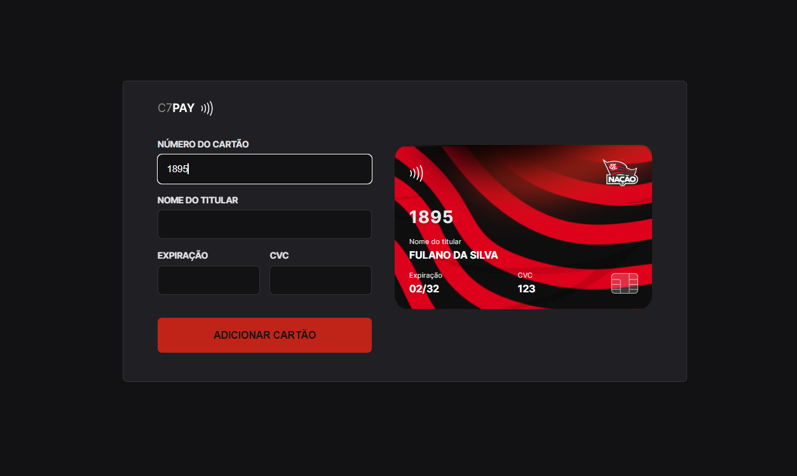

<h1 align="center">C7 PAY 🏦</h1>

<p align="left">🔥An application that simulates adding a credit card via the Web, allowing you to check which card is with some variations of specific rules made with JavaScript!

<br />

The objective of the project is to improve the understanding of Clean Code, JavaScript and use of IMask for future projects accessible and easy to understand. The project was developed using HTML, CSS, JavaScript, JSON, Node and NPM, Vite and iMask. There are some tasks in the Roadmap that haven't been completed yet, such as creating more card variations.

<br />

## 💻 Version Web

<br />

<div id="layout" align="center">
  <p align="stretch">
    
    
  </p>
</div>

<br />

Test yourself!!🔎 https://c7-pay.vercel.app/

<br />

## 🔧 Updates

<br />

<p align="left">

The new feature added is a curiosity hidden in the application that is triggered by typing the number 1895 in the first digits of the card. By doing so, the application presents a skin of the Flamengo football team, as the team was founded on November 15, 1895. This is an interesting feature that can be used to entertain and surprise the application's users. It is worth mentioning that this functionality does not interfere with the main functionality of the application, and is just an additional curiosity for users who want to explore the application further.

</p>

<br />

<div id="layout" align="center">
  <p align="stretch">
    
  </p>
</div>

<br />

## 🎡 Functionalities

- Credit Card Addition: Users can add their credit card information including card number, expiration date, security code and cardholder name

- Credit card validation: the application verifies that the information entered by the user corresponds to a valid credit card, using credit card validation algorithms

<br />

## 🔧 Resources used

This project was developed with the following resources and technologies:

- [HTML](https://developer.mozilla.org/pt-BR/docs/Web/HTML)
- [CSS](https://developer.mozilla.org/pt-BR/docs/Web/CSS)
- [JavaScript](https://developer.mozilla.org/pt-BR/docs/Web/JavaScript)
- [JSON](https://developer.mozilla.org/pt-BR/docs/Learn/JavaScript/Objects/JSON)
- [Node e NPM](https://nodejs.org/)
- [Vite](https://vitejs.dev/)
- [iMask](https://imask.js.org)

<br />

## 🚀 How to run the project

1. Clone the repository to your local machine.

```bash
$ git clone https://github.com/maarcusvinicius/C7-PAY.git
```

2. Navigate to the project directory and install dependencies.

```bash
$ cd C7-PAY
$ npm install
```

3. Start the development server.

```bash
$ npm start
```

4. Open your browser and go to http://localhost:3000 to view the application.

<br />

## 💻 Project structure

```bash
C7-PAY/
  assets/
  node_modules/
  public/
  src/
    css/
      base.css
      credit-card.css
      form.css
      index.css
    main.js
  .gitignore
  index.html
  package-lock.json
  package.json
```

<br />

## 🏍️ Components

<br />

- `assets`: folder that contains files such as images, fonts and other resources used in the project.

- `node_modules`: folder containing all project dependencies installed by the Node.js package manager.

- `public`: folder containing the index.html file and other static files that will be used in the browser.

- `src`: main project folder where the source code and style files are located. It has subfolders:
    
     - `css`: contains the project's style files, including the files
     CSS for each part of the application (base, credit card and form).

     - `main.js`: it is the project's main file in JavaScript.

- `.gitignore`: file that lists the files and folders that should be ignored by Git when performing a commit.

- `index.html`: main HTML file that renders the application page in the browser.

- `package-lock.json`: file that stores information about specific versions of project dependencies installed by npm.

- `package.json`: manifest file that contains information about the project, including name, description, version, author, license and project dependencies.

<br />
<br />
<h4 align="center">
  🚧 C7 PAY 🏦 FINISHED 🚧
</h4>
<br />
<br />
<br />
<br />
<br />

Made with ❤️ by Marcus Vinicius 👋🏽 Get in touch!

//done readme marcus


### 𝐇𝐞𝐥𝐥𝐨 𝐭𝐡𝐞𝐫𝐞, 𝐟𝐞𝐥𝐥𝐨𝐰 <𝚌𝚘𝚍𝚎𝚛𝚜/>! 

I'm a Web Developer, a programmer looking to make <br /> a difference in the digital world. [**Personal Site**](https://marcus-dev.vercel.app/) 🚀

#### My current tools

📲 Front-end Mobile with React Native  
💻 Front-end Web with Reactjs  
📡 Back-end with Nodejs  
🔣 Typescript  
🧰 And more...

#### 💬 Find me elsewhere

[](https://www.linkedin.com/in/marcus-vinicius-507718228/)
[](marcus.editor77@gmail.com)
